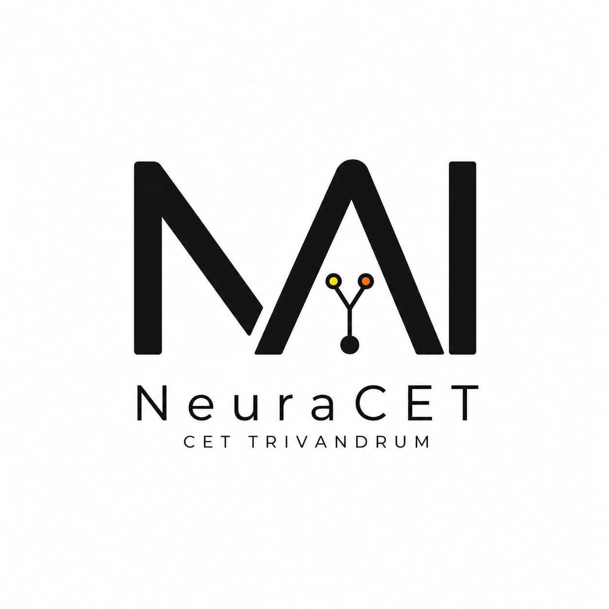
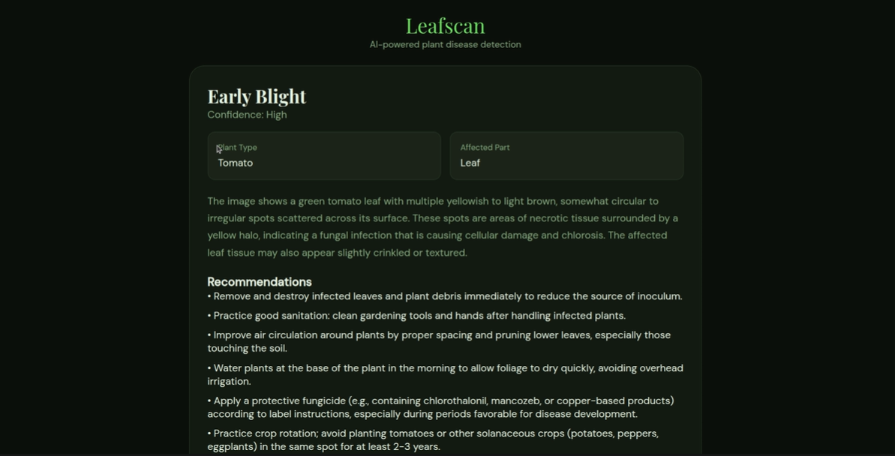
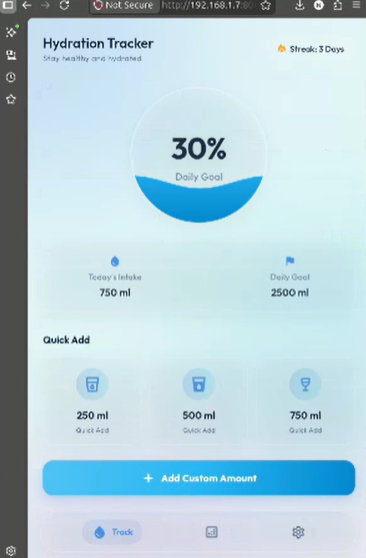
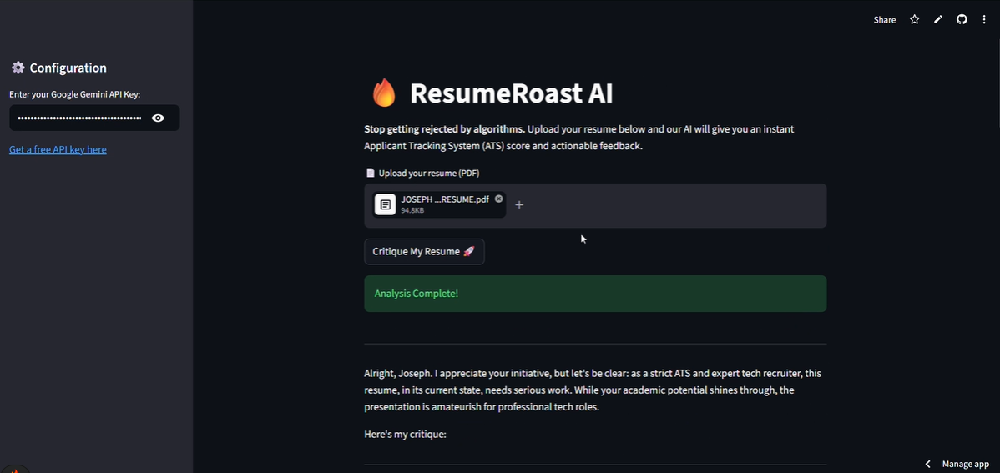
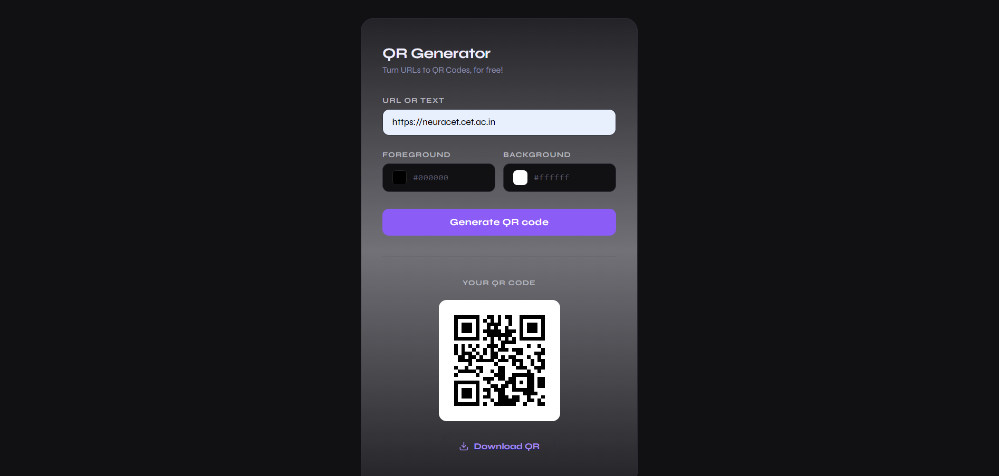
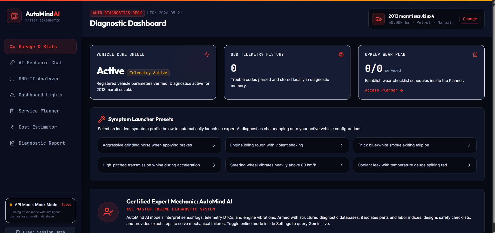

<p align="center">
  
</p>

<h1 align="center">NeuraCET</h1>

<p align="center">
  <strong>The Applied AI Club at College of Engineering Trivandrum, Kerala</strong>
</p>

<p align="center">
  <em>We don't just learn about AI — we build with it.</em>
</p>

<p align="center">
  <a href="https://neuracet.github.io"></a>
  <a href="https://github.com/NeuraCET"></a>
  <a href="https://www.linkedin.com/in/neuracet-a87092410/"></a>
  <a href="https://www.instagram.com/neuracet"></a>
</p>

<br />

<p align="center">
  
  
  
  
</p>

---

## 🧠 What is NeuraCET?

**NeuraCET** isn't a coding club. It's an **applied AI movement** at CET.

We build agents, ship projects, contribute to open source, and push students from prompt users to **AI engineers**. Our mission is to help CET students move from passive AI users to active AI builders through hands-on projects, workshops, research, open-source contribution, and real-world problem solving.

> *"The best way to understand AI is to build something real with it."*
> — NeuraCET Team

---

## 🎯 Mission & Vision

<table>
  <tr>
    <td width="50%" valign="top">
      <h3>🚀 Mission — Make AI Real</h3>
      <p>To help CET students move from passive AI users to active AI builders through hands-on projects, workshops, research, open-source contribution, and real-world problem solving.</p>
    </td>
    <td width="50%" valign="top">
      <h3>🔭 Vision — Build the Campus Nerve Center</h3>
      <p>To make NeuraCET the central AI innovation community of CET, where students from every branch can learn, build, publish, collaborate, and create AI systems that solve meaningful problems.</p>
    </td>
  </tr>
</table>

---

## ⚡ Sub-Teams — Four Teams, One Nervous System

| # | Team | Focus | What They Do |
|:-:|:-----|:------|:-------------|
| 💻 | **Technical** | Build | LangChain, AI agents, open-source contributions — they ship. |
| 📡 | **Outreach & Gemini** | Community | Campus Ambassador programs, events, community growth. |
| 🎨 | **Design** | Identity | Visual identity that makes AI feel human. |
| ✍️ | **Content Media** | Signal | Blogs, threads, and AI explainers that don't suck. |

---

## 🛠️ Projects — Built by the Club

<table>
  <tr>
    <td align="center" width="20%">
      <br />
      <strong>🌿 LeafScan</strong><br />
      <sub>Vision · Plant AI</sub><br />
      <sub>Leaf image analysis tool that identifies leaf types and surfaces useful details.</sub>
    </td>
    <td align="center" width="20%">
      <br />
      <strong>💧 Hydration Tracker</strong><br />
      <sub>Health · Habit</sub><br />
      <sub>Habit tracker for daily water intake with quick adds, goals, and streaks.</sub>
    </td>
    <td align="center" width="20%">
      <br />
      <strong>📄 Resume Critiquer</strong><br />
      <sub>AI Review · Resume</sub><br />
      <sub>Entertainment-first resume roaster with sharp AI feedback.</sub>
    </td>
    <td align="center" width="20%">
      <br />
      <strong>📱 QR Code Generator</strong><br />
      <sub>Utility · Web</sub><br />
      <sub>Simple utility that generates QR codes for any webpage link.</sub>
    </td>
    <td align="center" width="20%">
      <br />
      <strong>🔧 Auto Diagnostic Tool</strong><br />
      <sub>Diagnostics · AI</sub><br />
      <sub>AI vehicle diagnostic desk that identifies problems and estimates repair cost.</sub>
    </td>
  </tr>
</table>

---

## 🗺️ The Builder Roadmap

A practical path from curiosity to real AI systems:

```
┌──────────────────┐     ┌──────────────────┐     ┌──────────────────┐
│                  │     │                  │     │                  │
│   01 · LEARN     │────▶│   02 · BUILD     │────▶│   03 · SCALE     │
│                  │     │                  │     │                  │
│  AI/ML           │     │  AI agents,      │     │  Advanced AI/ML, │
│  fundamentals,   │     │  hackathons,     │     │  LLM fine-tuning,│
│  basic apps      │     │  real-world      │     │  CET's own AI    │
│  using AI tools  │     │  AI software     │     │  assistant       │
│                  │     │                  │     │                  │
└──────────────────┘     └──────────────────┘     └──────────────────┘
```

---

## 🏗️ Tech Stack — This Website

This repository hosts the official **NeuraCET** website — a single-page, zero-dependency site built with:

| Layer | Technology |
|:------|:-----------|
| **Structure** | Semantic HTML5 |
| **Styling** | Vanilla CSS with custom properties (design tokens) |
| **Animation** | CSS keyframes + JavaScript Canvas (neural network visualization) |
| **Typography** | [Space Grotesk](https://fonts.google.com/specimen/Space+Grotesk) · [Inter](https://fonts.google.com/specimen/Inter) · [JetBrains Mono](https://fonts.google.com/specimen/JetBrains+Mono) |
| **Hosting** | GitHub Pages |
| **Dependencies** | **Zero.** Pure HTML, CSS, and vanilla JS. |

### ✨ Design Highlights

- 🌑 **Dark brutalist aesthetic** — Grid backgrounds, sharp borders, flat drop shadows
- 🎯 **Custom cursor** with hover state transitions
- 🧬 **Interactive neural field** — Real-time canvas animation responding to mouse movement
- ⌨️ **Typewriter effect** in the hero section cycling through club identities
- 📜 **Scroll-triggered reveals** via IntersectionObserver
- 🎠 **Infinite marquee banners** with seamless looping
- ♿ **Fully accessible** — ARIA labels, semantic HTML, `prefers-reduced-motion` support
- 📱 **Responsive design** — Optimized for mobile, tablet, and desktop breakpoints

---

## 👥 The Team

<table>
  <tr>
    <th>💻 Technical</th>
    <th>📡 Outreach & Gemini</th>
    <th>🎨 Design</th>
    <th>✍️ Content Media</th>
  </tr>
  <tr>
    <td valign="top">
      Kailas Chandran MS <sub>(IE)</sub><br />
      S Kailas <sub>(EL)</sub><br />
      Joseph Jayan <sub>(CS)</sub>
    </td>
    <td valign="top">
      Akshay V Sarma <sub>(IE)</sub><br />
      Anjana George <sub>(IE)</sub><br />
      Nihal Naseem RA <sub>(ECE)</sub><br />
      Nakul G <sub>(EL)</sub>
    </td>
    <td valign="top">
      Arun Krishna U <sub>(ECE)</sub><br />
      Madhav B <sub>(IE)</sub><br />
      Nandhu Ramesh <sub>(EL)</sub><br />
      Sreesanth T <sub>(ECE)</sub>
    </td>
    <td valign="top">
      Vishnusree N <sub>(CS)</sub><br />
      Amit A Chengode <sub>(CS)</sub><br />
      Sanjay Harishankar <sub>(CS)</sub>
    </td>
  </tr>
</table>

---

## 🚀 Getting Started

### Run Locally

No build tools. No package managers. Just open the file.

```bash
# Clone the repository
git clone https://github.com/NeuraCET/NeuraCET.github.io.git

# Navigate into the project
cd NeuraCET.github.io

# Open in your browser
open index.html
# or
xdg-open index.html        # Linux
start index.html            # Windows
```

Or use a local server for the best experience:

```bash
# Python
python3 -m http.server 8000

# Node.js (npx)
npx -y serve .
```

Then visit `http://localhost:8000`

---

## 📁 Project Structure

```
NeuraCET.github.io/
├── index.html                  # Entire site — HTML, CSS, and JS in one file
├── assets/
│   ├── neuracet-logo-384.png   # Club logo
│   ├── leafscan.png            # Project screenshot
│   ├── hydration-tracker.png   # Project screenshot
│   ├── resume-critiquer.png    # Project screenshot
│   ├── qr-code-generator.png  # Project screenshot
│   └── auto-diagnostic-tool.png # Project screenshot
└── README.md                   # You are here
```

---

## 🤝 Contributing

NeuraCET is open to all CET students. **No gatekeeping. Just builders.**

1. **Fork** the repository
2. **Create** a feature branch: `git checkout -b feature/your-idea`
3. **Commit** your changes: `git commit -m "Add: your feature description"`
4. **Push** to the branch: `git push origin feature/your-idea`
5. **Open** a Pull Request

---

## 📜 License

This project is open source and available for the NeuraCET community.

---

<p align="center">
  <strong>THINK · BUILD · SHIP · LEARN · REPEAT</strong>
</p>

<p align="center">
  <sub>Made with 🧡 by NeuraCET · College of Engineering Trivandrum, Kerala · Est. 2026</sub>
</p>
